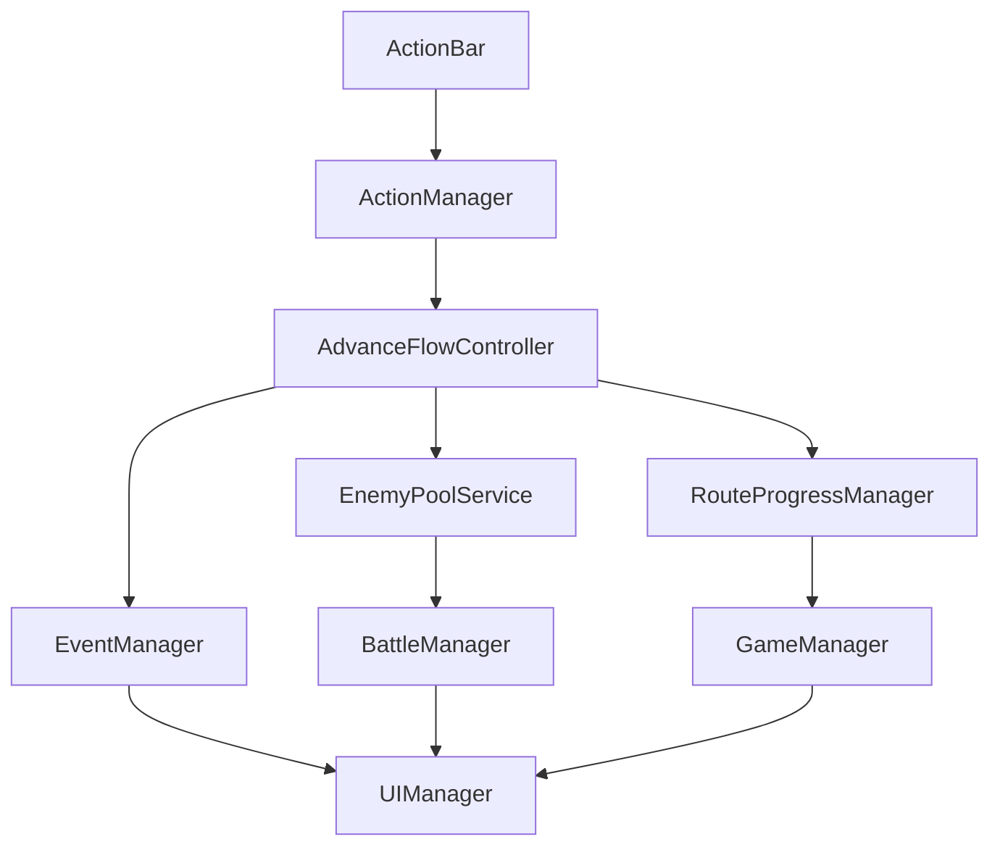

# 数据流向

朡用三条最常用链路”明当前项盕何流轂内容基于现有代码结构，便于你快速定位修改入口?
## 1) 新游戏初始化链路

**盠**：初始化玩数据、路线进度，并切到主 UI?
链路（念级）：

- `GameManager.NewGame()`
  - 初?重置 `PlayerInfo`
  - `RouteProgressManager.Initialize(startDistance, startDay)`
  - 绑定 `playerInfo.health.OnChangedEvent`（健康归?-> GameOver?  - 触发 `NewGameEvent`
- `UIManager` 订阅 `NewGameEvent` 执 `NewGameAction()`
  - 打开常驻面板：`PlayerDate` / `RouteInfo` / `ActionBar`

## 2) 行动（前?探索）分流链?
**盠**：一次动触发消耗扣除，然后按率分流到物资/事件/战斗?
链路（念级）：

- UI 按钮：`ActionBarPanel.OnAdvance/OnExplore`
- 行为入口：`ActionManager.TryAdvance/TryExplore`
- 流程控制：`AdvanceFlowController.TryAdvance/TryExplore`
  - 状机：`Idle -> Running -> (Transit) -> Idle`
  - 先扣消：`energy -10`、`hunger -5`
  - 前进时推进距离：`RouteProgressManager.Advance(1)`
  - 构建 `regionCode = main_sub`（来?RouteProgress?  - 按率分流：
    - 物资：提示后?Idle
    - 随机事件：`EventManager.GetRandomEventByRegionCode` + `EventManager.RandomEventIE`
      - 若事件回?`enemyId`：进?Transit，调?`BattleManager.StartBattleByEnemyId`
    - 遇敌：`EnemyPoolService.GetRandomEnemyByRegionCode` -> `BattleManager.StartBattleByEnemyId`

## 3) 跺进度广播链路

**盠**：当 distance/day 变化时，触发判定?UI 刷新?
链路（念级）：

- `RouteProgressManager.ModifyDistance/ModifyDay`
  - 广播 `OnDistanceChanged/OnDayChanged`
  - distance 变化时：内部处理主地区切换并广播 `OnMainRegionChanged`
- `GameManager` 订阅进度变化?  - `OnDistanceChanged` -> `CheckDistance()`（到?-> `GameOver()`?  - `OnDayChanged` -> `CheckDay()`（当前仅日志提示?- UI 面板侧（例 `RouteInfoPanel`）常通过 `UIManager.UpdateInfo()` 或阅事件刷新展?
## 关键边界与注意点

- `RouteProgressManager` ?**进度权威?*：不要在多个地方各自维护 day/distance?- `UIManager` ?**面板策略权威?*：面板显隐不要分散到业务脚本里抢控制权?- `AdvanceFlowController` ?**行动分流权威?*：避?ActionManager/UI 层重复实现分流辑?
## 数据流示意（图）

